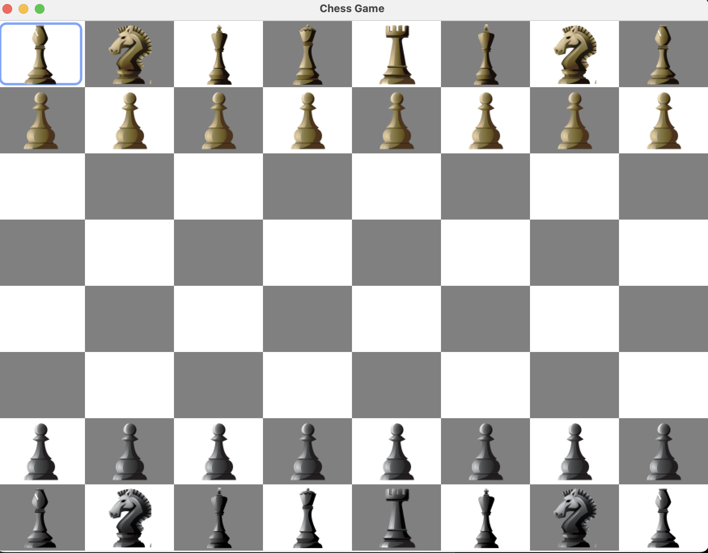

# Chess Game

Chess Game is a Java application implementing the classic game of chess. It provides players with a platform to enjoy the strategic and tactical challenges of this timeless board game.

## 📝 Installation

- Clone or download this repository to your computer.
- Make sure you have Java installed on your system.
- Compile the Java files using javac *.java.
- Run the game using java Main.

## 📚 Technologies | Frameworks | Tools
- Java programming language
- Swing framework for GUI development

## ♟️ How to Play

- Use the mouse to select and move pieces on the chessboard.
- Follow the standard rules of chess to play the game.
- Enjoy the strategic depth and challenge of chess against the computer or another player.
